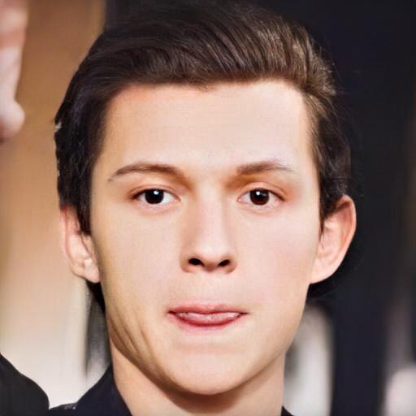

# Lambda Notes


### Install

Step 1:

```
su craig
sudo su
conda create -n DFD-deepvoodoo python=3.6
conda install pytorch torchvision cudatoolkit=10.1 -c pytorch -n DFD-deepvoodoo
conda install -c conda-forge/label/cf202003 dlib -n DFD-deepvoodoo

conda activate DFD-deepvoodoo
pip install dominate
pip install opencv-python
pip install scikit-image
pip install tqdm
```

Step 2:

Download these files [links](https://drive.google.com/drive/folders/1bayYIUMCSGmoFPyd4Uu2Uwn347RW-vl5).

Unzip and put them to DFDNet root directory.


### Usage


#### Run DFD on DFL aligned src/dst Images

- `aligned-dir`: Folder for DFL extracted src/dst images

```
# Call test_FaceDict_aligned.py
# Optional: Use --blur-radius to blur the input image before DFD. Useful for removing some artifacts in high resolution merged images. Default 0 (no blur). https://pillow.readthedocs.io/en/5.1.x/reference/ImageFilter.html#PIL.ImageFilter.GaussianBlur
# Output will be saved in path-to-input-images_enchanced_rblur_radius

python /ParkCounty/home/SharedApp/DFDNet/DFDNet_DeepVooDoo/test_FaceDict_aligned.py  \
--test-dir path-to-input-images \
--gpu-id 0
```

Example

```
python /ParkCounty/home/SharedApp/DFDNet/DFDNet_DeepVooDoo/test_FaceDict_aligned.py  \
--test-dir /ParkCounty/home/DFDNet_data/DFL_ALIGNED_RAWPRED/aligned_frames \
--gpu-id 0
```


#### Run DFD on DFL rawmerged Images 

- `test-dir`: Folder for rawmerged images
- `aligned-dir`: Folder for DFL extracted dst images. We need it to extract landmarks. 
Make sure all images in `test-dir` has its corresponding images in `aligned-dir`

```
# Call test_FaceDict_aligned.py
# Need to pass --aligned-dir so landmarks can be extracted. 
# Optional: Use --aligned-postfix to replace '.png' in the merged image name. Default is '_0.jpg'
# Optional: Use --blur-radius to blur the input image before DFD. Useful for removing some artifacts in high resolution merged images. Default 0 (no blur). https://pillow.readthedocs.io/en/5.1.x/reference/ImageFilter.html#PIL.ImageFilter.GaussianBlur
# Output will be saved in path-to-input-images_enchanced_rblur_radius

python /ParkCounty/home/SharedApp/DFDNet/DFDNet_DeepVooDoo/test_FaceDict_aligned.py  \
--test-dir path-to-input-images \
--aligned-dir path-to-aligned-images \
--gpu-id 0
```

Example

```
python /ParkCounty/home/SharedApp/DFDNet/DFDNet_DeepVooDoo/test_FaceDict_aligned.py  \
--test-dir /ParkCounty/home/DFDNet_data/DFL_ALIGNED_RAWPRED/merge_rawpred \
--aligned-dir /ParkCounty/home/DFDNet_data/DFL_ALIGNED_RAWPRED/aligned_frames \
--gpu-id 0
```

#### Run All Steps (include alignment and detection) on Whole Image

Step 1: Copy test images to somewhere `path-to-input-images` on your machine.

Step 2: Run the following command on any tweeks. The result will be saved to `path-to-input-images_enhanced_upscale`

```
conda activate DFD-deepvoodoo

python /ParkCounty/home/SharedApp/DFDNet/DFDNet_DeepVooDoo/test_FaceDict.py  \
--test-dir path-to-input-images \
--gpu-id 0 \
--upscale your-scale \
--only-final 

```

Example

```
conda activate DFD-deepvoodoo

python /ParkCounty/home/SharedApp/DFDNet/DFDNet_DeepVooDoo/test_FaceDict.py  \
--test-dir /ParkCounty/home/DFDNet_data/test \
--gpu-id 0 \
--upscale 4 \
--only-final 
```


* `test-dir`: Folder to store test images. Default: `/ParkCounty/home/DFDNet_data/test`. Enhanced results will be put into `test_dir_enhanced_upscale`
* `gpu-id`: Index of GPU. Default 
* `upscale`: Upscale factor. If the input image (`Step0_Input`) is of size `512`, the final result (`Step4_FinalResults`) will be `512`x`upscale`. The crops, however, are always of size `512`.
* `only-final`: Add this flag to only save results for Step3 and Step4.

### Results

 <table  style="float:center" width=100%>
 <tr>
  <th><B> Input </B></th><th><B>Final Results (UpScaleWhole=4)</B></th>
 </tr>
  <tr>
  <td>
  
  </td>
  <td>
  
  </td>
 </tr>
  
 </table>

